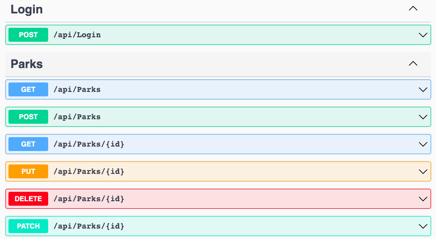

# Parks API 

#### By E. Luckie ☀️

#### This web API acts as a collection of National and State Parks. Users can `GET` the full list of parks saved in the database, as well as add a park, update a park, or delete a park from the database. `GET` requests for a non-specific park also returns the Total Park Count and is paginated.

## Technologies Used

* C#
* .NET 7.0
* Postman
* Swagger
* MySQL Workbench
* NewtonSoft
* Identity
* Jwt Tokens
* Markdown
* Git

## Set Up and Run Project

1. Clone this repository.
2. Open the terminal and navigate to this project's production directory. called "ParksApi". Run the command `dotnet restore` to restore all necessary packages.
3. Then, still within the production directory "ParksApi", create a new file called `appsettings.json`.
4. Within `appsettings.json`, put in the following code, replacing the `[YOUR-USERNAME-HERE]` and `[YOUR-PASSWORD-HERE]` with your own credentials for MySQL. 

```json
{
  "ConnectionStrings": {
    "DefaultConnection": "Server=localhost;Port=3306;database=parks_api;uid=[YOUR-USERNAME-HERE];pwd=[YOUR-PASSWORD-HERE];"
  }
}
```

5. Ensure you save the changes made to the `appsettings.json` file and then run the command `dotnet ef database update` in the command line. This will create the base database in MySQL Workbench including the parks that are hard-coded into the database.
6. Within the production directory "ParksApi", run `dotnet run` in the command line to start the project in development mode.

## Models


## Endpoints



### Optional Parameters

| Parameter | Type | Required | Description |
| --------- | ----- | ------- | ----------- |
| city | string | not required | returns parks with a matching city value |
| state | string | not required | returns parks with a matching state value | 
| statePark | boolean | not required | returns parks that have a StatePark property value of true |
| nationalPark | boolean | not required | returns parks that have a NationalPark property value of true |
| pageSize | integer | default value set to 10 | value is editable to change the amount of parks displayed per page in the response |  
| pageNumber | integer | default value set to 1 | value is editable to change the current page number of results displayed in the response |

#### Example Queries

The following query will return all parks with a city value of "Aurora":

>```GET http://localhost:5002/api/parks?city=aurora```


The following query will return all parks with a state value of "California":

>```GET http://localhost:5002/api/parks?state=california```


The following query will return all parks with a statePark value of "true":

>```GET http://localhost:5002/api/parks?statePark=true```


It's possible to include multiple query strings by separating them with an `&`:

>```GET http://localhost:5002/api/parks?state=Colorado&nationalPark=true```


The following query will return all parks on page 2, and each page will list 3 parks (rather than the default of 10 parks per page, and starting at page 1):

>```GET http://localhost:5002/api/Parks?page=2&pageSize=3```


#### Example Response

`GET http://localhost:5002/api/Parks?page=1&pageSize=2`

```json
{
  "queriedParks": [
    {
      "parkId": 1,
      "name": "Grand Canyon National Park",
      "city": "Grand Canyon Village",
      "state": "Arizona",
      "nationalPark": true,
      "statePark": false
    },
    {
      "parkId": 2,
      "name": "Cherry Creek State Park",
      "city": "Aurora",
      "state": "Colorado",
      "nationalPark": false,
      "statePark": true
    }
  ],
  "totalParks": 8,
  "currentPage": 1,
  "parksPerPage": 2
}
```

**NOTE:** You may choose to update either the `currentPage` in the `GET` request to see a different page of results, or update `pageSize` to a number greater than the number of `totalParks` so all parks will display in one page.


### Additional Requirements

#### for POST request

When making a `POST` request to `http://localhost:5002/api/Parks/`, you need to include a **body**. Here's an example body in JSON:

```json
{
  "name": "Rocky Mountain Nat'l Park",
  "city": "Estes Park",
  "state": "Colorado",
  "nationalPark": true,
  "statePark": false
}
```

#### for PUT request

When making a `PUT` request to `http://localhost:5002/api/Parks/{id}`, you need to include a **body** that includes the park's `parkId` property which must match the id number in the URL. Here's an example in JSON:

`PUT http://localhost:5002/api/Parks/1`

```json
{
  "parkId": 1,
  "name": "Rocky Mountain National Park",
  "city": "Estes Park",
  "state": "Colorado",
  "nationalPark": true,
  "statePark": false
}
```

#### for PATCH request

When making a `PATCH` request to `http://localhost:5002/api/Parks/{id}`, you need to include a **body** that includes the park's property to update, an operation to perform, and a new value. The `{id}` in the URL should be replaced with the `parkId` of the park you're updating. Here's an example body in JSON:

_(Though you may choose to include the old value of the property with "from", it is **not required** and is only included here for clarity's sake.)_

```json
{
  "path": "city",
  "op": "replace",
  "from": "Yosemite Nat'l Park",
  "value": "Yosemite National Park"
}
```

You are able to update multiple properties at once by chaining together with a comma separating each `PATCH` operation. Here's an example body in JSON:

```json
{
  "path": "city",
  "op": "replace",
  "from": "Yosemite Nat'l Park",
  "value": "Yosemite National Park"
},
{
  "path": "statePark",
  "op": "remove",
}
```


| "op" | result |
| ---- | ------ |
| "replace" | replaces specified path's corresponding property with value specified |
| "remove" | resets specified path's corresponding property to null (or false, if boolean) | 

**NOTE:** Though there are additional operations within Patch functionality, this API has not been configured to need or support any other operations aside from `REPLACE` and `REMOVE`


## Known Bugs

* No known bugs.

## Stretch Plans

* Add Users to database & remove UsersController 
* Add a `RANDOM` endpoint that randomly returns a park.
* Document token-based authorization use
* Add a second custom endpoint that accepts parameters. Example: a `SEARCH` route that allows users to search by specific park names.
* Add a front end MVC application that consumes this API.

## License

MIT License

Copyright (c) 2023 Luckie